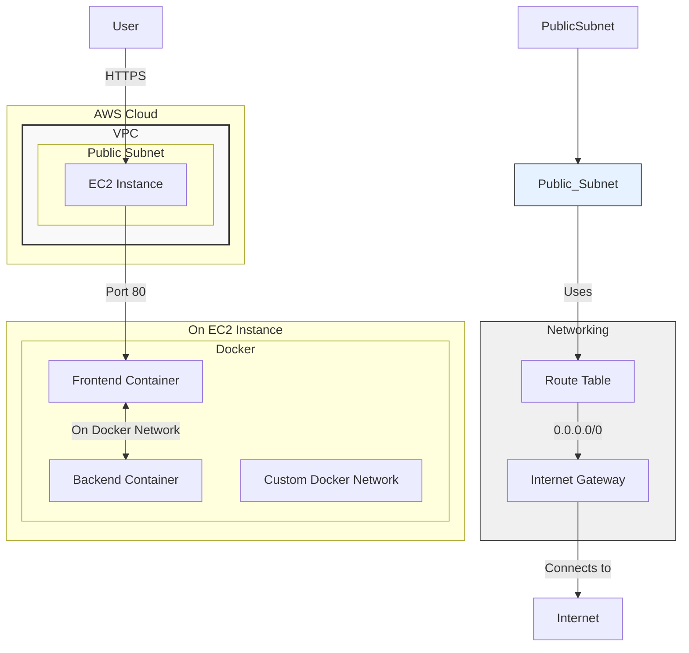
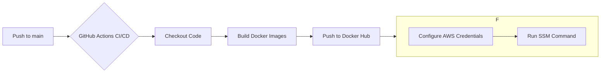

# Lyrica - Lyrics Finder

Lyrica is a full-stack web application built and deployed using modern DevOps practices. This project demonstrates a complete CI/CD pipeline for a containerized application, deployed on a custom cloud infrastructure provisioned via Terraform.

---

## Project Overview

Lyrica consists of:
- **Frontend**: A user-facing web interface to search for lyrics.
- **Backend**: An API service that serves lyrics data.
- **Containerization**: Both frontend and backend are containerized using Docker.
- **CI/CD**: Automated build, test, and deployment pipeline using GitHub Actions.
- **Infrastructure as Code (IaC)**: Cloud infrastructure on AWS is managed by Terraform.

---

## Architecture

The architecture is designed to be modular, scalable, and maintainable, following best practices for cloud-native applications.

### Infrastructure Architecture

The entire infrastructure is provisioned on AWS using Terraform, ensuring that the environment is reproducible and version-controlled.

- **VPC**: A custom Virtual Private Cloud (VPC) provides an isolated network environment.
- **Public Subnet**: A single public subnet is created to host publicly accessible resources.
- **Internet Gateway (IGW)**: Allows communication between the VPC and the internet.
- **Route Table**: Directs traffic from the subnet to the Internet Gateway.
- **Security Group**: Acts as a virtual firewall, allowing inbound traffic on ports 22 (SSH), 80 (HTTP), and 3000 (Backend).
- **EC2 Instance**: A single EC2 instance is launched to host the Dockerized application.

Terraform modules are used for creating the VPC, Security Group, and EC2 instance, promoting reusability and clean code structure.

### CI/CD Pipeline

The CI/CD pipeline is orchestrated using **GitHub Actions**.

1.  **Trigger**: The workflow is triggered on a `push` to the `main` branch.
2.  **Build**: Docker images for the frontend and backend are built and tagged.
3.  **Push**: The newly built images are pushed to Docker Hub.
4.  **Deploy**: The deployment to the EC2 instance is handled by **AWS Systems Manager (SSM) Send-Command**. This approach is more secure than exposing SSH keys. The SSM command pulls the latest Docker images and restarts the containers.

---
